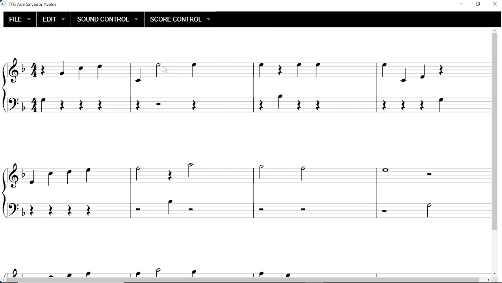

# Interactive Interface for Visualizing and Editing MusicXML Transcriptions

Full source code of my Bachelor's final project, including all files required to run the application.

This project transcribes audio files (MP3 or MIDI) into MusicXML scores and provides an interactive interface for viewing, editing, and applying musical effects.

## Key Features

- Convert audio files into MusicXML scores for display and manipulation.  
- Edit scores by inserting, deleting, or modifying notes and other musical parameters.  
- Apply built-in filters or import custom Python plugins for new effects.  
- Listen to changes in real-time through the interface.  
- Interface built with JavaScript, SVG, HTML, jQuery, [VexFlow](https://github.com/0xfe/vexflow), and [Superfish.js](https://github.com/joeldbirch/superfish) (including MegaFish for advanced dropdown menus); core engine in Python. 

Automatic musical transcription remains a challenging research area. This tool allows users to review and correct possible transcription errors before saving, ensuring greater accuracy.

## Demonstration Video
[](assets/demonstration_video.mp4)


## Installation
**Note:** Currently compatible with **Windows only**.

1. Install [WSL (Windows Subsystem for Linux)](https://learn.microsoft.com/en-us/windows/wsl/install) by following the instructions on the official page.
2. Install [Waon](https://kichiki.github.io/waon/).
3. Install the required Python packages by running:

````
pip install -r requirements.txt
````

## Usage

To try the transformations from MP3 to MusicXML:

1. Make sure you have installed the **WaoN** program.  
2. Ensure that WaoN is accessible from your WSL environment. Update the path in your code as needed:

```python
linux_command = f"/home/home/WaoN/waon -i {file_source} -o {file_target}"
```

To test the selection of new plugins, update the plugin path in your code:
```python
file_path = f'C:\\Users\\adasa\\Documents\\UPC\\TFG\\dropdown_buttons\\tfg (3)\\tfg\\plugins\\{name}.py'
```

## Future Development

- Transform the application into a web service.  
- Integrate AI-based technologies to improve transcription accuracy.